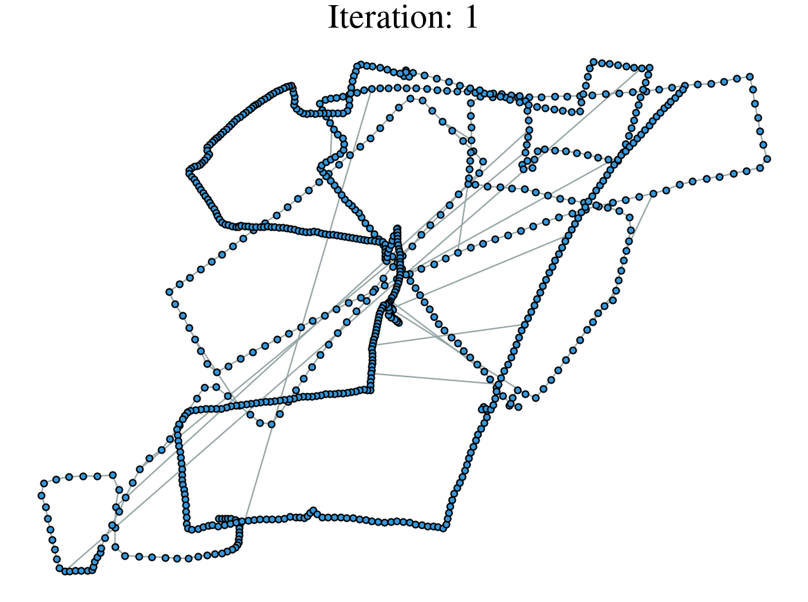

# Pose graph optimization

Python implementation of 2D pose graph optimization. For more information, please refer to my blog: [Lie theory in Robotics](https://dgbshien.com/docs/blogs/lie-theory.pdf).

**Prerequisites**
```sh
pip install numpy scipy matplotlib
```

**Run**
```sh
python main.py
```

Evaluated on [2D Pose Graph Optimization](https://lucacarlone.mit.edu/datasets/) dataset.

| INTEL               | M3500               | MITb               |
| ------------------- | ------------------- | ------------------ |
|  |  |  |
